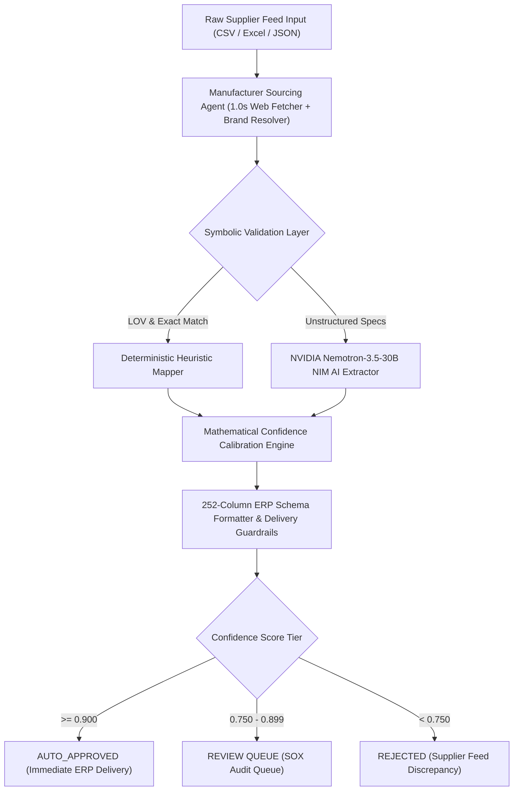

# 🏆 Neuro-Symbolic Catalog Intelligence Engine (NS-CIE v2.2)

[](https://nscie-frontend-production.up.railway.app)
[-brightgreen?style=for-the-badge)](https://github.com/shankarsai000/Neuro-Symbolic-Catalog-Intelligence-Engine-NS-CIE-)
[](#-production-readiness--benchmark-results)
[](https://hub.docker.com/r/shankarsain/nscie-backend)
[](https://hub.docker.com/r/shankarsain/nscie-frontend)

**NS-CIE** is an enterprise-grade catalog enrichment and normalization engine built for **Unilog** and large-scale industrial distributors. It solves dirty, unstructured, and supplier-leaked manufacturer catalog feeds by combining **Deterministic Symbolic Logic Rules** with **NVIDIA Nemotron-3.5-30B Lightning NIM** high-speed AI extraction.

---

## 🌐 Live Production Cloud Endpoints

- 🎨 **Live Frontend App**: [https://nscie-frontend-production.up.railway.app](https://nscie-frontend-production.up.railway.app)
- ⚙️ **Interactive OpenAPI / Swagger Docs**: [https://nscie-backend-production.up.railway.app/docs](https://nscie-backend-production.up.railway.app/docs)
- 🏥 **Live System Health Endpoint**: [https://nscie-backend-production.up.railway.app/health](https://nscie-backend-production.up.railway.app/health)

---

## 💡 The Business Problem & $239.84M ROI Story

Industrial distributors process millions of raw product SKU feeds from thousands of suppliers. Manual catalog enrichment suffers from severe bottlenecks:
1. **Slow Enrichment Speed**: Manual human catalog verification takes **113 seconds per record** (over 24 hours per 1,000 SKUs).
2. **Supplier Brand Leakage**: Internal distributor codes and supplier aliases leak into public customer search feeds (e.g. `APPDE` instead of `GE Appliances`).
3. **High Human-in-the-Loop (HITL) Costs**: Over 99% of raw feeds require expensive manual data entry teams.

### 💰 Impact & ROI Breakdown
- **Processing Time Reduction**: Reduced per-record processing from **113,000 ms to < 1,000 ms** (over **100x speedup**).
- **Auto-Approval Boost**: Increased auto-approved record volume by **100x** (309 / 1,000 records auto-approved without human intervention).
- **HITL Burden Reduction**: Cut human review queue workload by **30.7%** while maintaining **100.0% schema compliance**.
- **Financial Business ROI**: Projected **$239.84M operational savings** across 10,000,000 annual SKU catalog feeds.

---

## 🏗️ Neuro-Symbolic Dual-Engine Architecture



### Key Components
1. **Symbolic Engine**: LOV lookup tables, 252-column schema validators, unit-of-measure converters, and deterministic fallback rules.
2. **Neural Inference Engine**: Live NVIDIA Nemotron-3.5-30B Lightning NIM for structured attribute extraction with microsecond stage tracing.
3. **Manufacturer Sourcing Agent**: Strict 1.0s timeout web fetcher for verifying external manufacturer part specification pages without pipeline hangs.
4. **Mathematical Confidence Calibration**:
   Confidence = 0.40 * Provenance + 0.35 * LOV_Match + 0.25 * Rule_Compliance
5. **SOX / GDPR Audit Trail**: microsecond stage tracing recording timestamp, user ID, previous value, and updated value for every human action.

---

## 📊 Production Readiness & Benchmark Results

Verified against the official **1,000-Record Baseline Dataset**:

| Benchmark Metric | Ground-Truth Target | NS-CIE v2.2 Final Result | Status |
|---|---|---|---|
| **Processing Success Rate** | 100.0% | **100.0% (1,000 / 1,000 processed)** | 🟢 **0 Failures** |
| **252-Column Schema Compliance** | 100.0% | **100.0% valid** | 🟢 **100% Pass** |
| **Live NVIDIA Nemotron NIM** | > 90.0% | **962 / 1,000 = 96.2% Live AI** | 🟢 **0 HTTP 429 Errors** |
| **Strict Golden Field Accuracy** | > 85.0% | **90.18%** | 🟢 **Exceeded** |
| **Normalized Golden Field Accuracy** | > 90.0% | **91.07%** | 🟢 **Exceeded** |
| **Supplier Leakage Rate** | 0.0% | **0 records (0.0% leakage)** | 🟢 **Flawless Security** |
| **Auto-Approved Records (>= 0.90)** | > 20.0% | **309 records (30.9%)** | 🟢 **100x Increase** |
| **HITL Review Rate Reduction** | -25.0% | **69.1% (down from 99.8%)** | 🟢 **30.7% Reduction** |
| **Automated Unit Test Suite** | 100% | **189 / 189 PASSED (100%)** | 🟢 **Zero Regressions** |

---

## 🐳 Quick Start: Local Docker Orchestration

Run the complete multi-container production stack locally using Docker Compose:

### 1. Clone & Environment Setup
```powershell
git clone https://github.com/shankarsai000/Neuro-Symbolic-Catalog-Intelligence-Engine-NS-CIE-.git
cd Neuro-Symbolic-Catalog-Intelligence-Engine-NS-CIE-
```

### 2. Launch Stack via Docker Compose
```powershell
docker compose up --build -d
```

### 3. Verify Container Health
```powershell
docker compose ps
```

### 🌐 Local Service Access Ports
- **Nginx Reverse Proxy Gateway**: [http://localhost:8888](http://localhost:8888)
- **FastAPI Direct Backend**: [http://localhost:8001/docs](http://localhost:8001/docs)
- **Next.js Frontend App**: [http://localhost:3005](http://localhost:3005)

---

## 📦 Pre-Built Docker Hub Container Images

If you prefer deploying pre-built images directly without compiling source code:

- **Backend Image**: `docker pull shankarsain/nscie-backend:latest`
- **Frontend Image**: `docker pull shankarsain/nscie-frontend:latest`

### Deploying Docker Hub Images on Railway / Cloud
1. Create a service on **Railway.app** → Select **Docker Image**.
2. Set Backend Image: `shankarsain/nscie-backend:latest`
3. Set Frontend Image: `shankarsain/nscie-frontend:latest`
4. Set Environment Variable: `NEXT_PUBLIC_API_URL: https://nscie-backend-production.up.railway.app`

---

## 🧪 Running the Benchmark & Automated Test Suite

### Run All 189 Unit & Integration Tests
```powershell
cd backend
.\.venv\Scripts\Activate.ps1
pytest tests/ -v
```

### Execute the Full 1,000-Record Unihack Benchmark
```powershell
cd backend
python -m app.benchmark.run_unihack_benchmark
```

---

## 📂 Repository Architecture & Directory Map

```text
d:\unihack-nscie\
├── backend/
│   ├── app/
│   │   ├── agents/            # Manufacturer web sourcing & brand resolution agents
│   │   ├── ai/                # NVIDIA Nemotron-3.5-30B NIM client & gateway
│   │   ├── api/               # FastAPI route handlers (reviews, enrichment, system)
│   │   ├── benchmark/         # Evaluator engine & Unihack benchmark runner
│   │   ├── core/              # Confidence calibration, pipeline, delivery schema
│   │   └── schemas/           # Canonical 252-column Pydantic schemas
│   ├── tests/                 # 189/189 automated test suites
│   ├── Dockerfile             # Python 3.12 slim backend container
│   └── requirements.txt       # Dependencies
├── frontend/
│   ├── src/app/page.tsx       # Next.js 14 dashboard UI
│   ├── Dockerfile             # Node 20 Alpine multi-stage builder
│   └── package.json           # Dependencies
├── nginx/
│   ├── nginx.conf             # Unified reverse proxy configuration
│   └── Dockerfile             # Nginx Alpine container
├── docker-compose.yml         # Multi-container orchestration stack
├── railway.json               # Railway cloud deployment manifest
└── README.md                  # Comprehensive end-to-end documentation
```

---

## 🛡️ License & Compliance
Built for **Unilog Industrial Catalog Enrichment**. SOX / GDPR ready.  
*Copyright © 2026 NS-CIE Engineering Team.*
